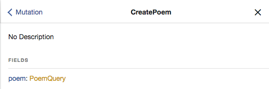

# 使用 Apollo Client 快速构建一个支持 GraphQL 的 Web App

这篇文章主要介绍 GraphQL 在 Client 的使用，为了方便，本文会直接使用 React 创建一个 Web demo 去介绍 Apollo 在 React 中的使用方法，当然在 ReactNative 中用法几乎一模一样。[Apollo Client](https://www.apollographql.com/client) 是一个 GraphQL Client Library ，Apollo Clinet (以下简称 Apollo) 可以让我们很方便的去和 GraphQL server 通信。

## 为什么要使用 GraphQL Client Library

你当然可以自己用 Http 去构造一个 GraphQL 请求，然后自己去处理网络问题，以及数据的缓存问题等等，这样我们就需要自己去处理很多业务逻辑以外的事情，而一个优秀的 GraphQL Client Library 可以帮助我们解决以下的一些问题 :

- 直接发送 Query 和 Mutation 到服务器
- 解析服务器端的 Response 并 normalize 数据缓存到本地
- 根据定义的 Schema 构建相应的 Query 和 Mutation
- 绑定 UI ，当数据发生变化时刷新 UI

我们比较了 [Apollo](https://www.apollographql.com/client/) 和 [Relay](https://facebook.github.io/relay/) ，最终选择了在项目中使用 Apollo ，Relay 是由 Facebook 开发的开源的 GraphQL Client ， 功能丰富并且做了很多性能优化。由于是一个大而全的库，学习难度比较大，而且 Relay 对于我们的 App 有点过于复杂，所以最终选择了 Apollo 。

Apollo 是一个由社区驱动开发的 GraphQL client，容易理解，可拓展性强，功能强大，可以在主流的开发平台上面使用。JavaScript 的版本可以在 React ，Angular ， Ember ，Vue 等主流的 Web 开发框架使用。Apollo 也提供了 Android 和 iOS 的版本。除此之外，Apollo 解决了我们上面提到的那些问题， Apollo 理解起来也比较简单，容易上手。

## 在 React 中集成 Apollo

**新建一个 React App**

```bash
#!/bin/bash
yarn global add create-react-app
create-react-app web
```

**安装 Apollo**

```bash
#!/bin/bash
cd web
yarn add apollo-boost react-apollo graphql
```

`apollo-boost` 包含了下面这些 packages

- `apollo-client`：Apollo 的所有操作都从这里开始，提供了丰富的 API
- `apollo-cache-inmemory`: Apollo 提供的 Cache
- `apollo-link-http`: Apollo 用来和 Server 端通信
- `apollo-link-error`: Apollo Client 内部错误处理
- `apollo-link-state`: 本地状态管理
- `graphql-tag`: 提供 `gql` 方法，方便定义 queries 和 mutations

`react-apollo`: 连接 Apollo 和 React 的 UI 组件

`graphql`: 分析和检查我们写的 query string

## 创建一个 Apollo Client

```js
import ApolloClient from "apollo-boost"

const client = new ApolloClient({
    uri: "http://0.0.0.0:5001/graphql"
})

export default client
```

利用 `apollo-boost` 提供的方法可以快速构建一个 ApolloClient，接下来我们就可以用这个 Client 去和 GraphQL server 通信了，Apollo 提供了多种方式与服务端通信，如果你只需要一个与服务端通信的 Client，你可以直接使用 ApolloClient 提供的 `query` 方法请求数据。

下图展示了我们的 GraphQL server 提供的可以查询的字段，关于如何搭建 GraphQL server 可以看我们之前的文章，这里就不赘述了。


从图中可以看出 server 的 Query 里面提供了 `poem` 字段，需要一个 Int 类型的参数 `id` ，`peom` 的类型是 `PoemQuery` ，`PoemQuery` 里面有一些字段可以查询。现在我们要用 ApolloClient 查询一个 `id` 为 1 的 `poem`：

首先定义 Query string templete：

```js
import gql from "graphql-tag"

export const QUERY_POEM = gql`
    query Poem($id: Int!) {
        poem(id: $id) {
            name
            content
        }
    }
`
```

接下来使用 ApolloClient 的 `query` 方法获取数据：

```js
import client from "./**";
import { QUERY_POEM } from './**';

client.query({
    query: QUERY_POEM,
    variables: {
        id: 1,
    }
}).then((data)=>{
    console.warn('------', data);
})
```

client的 `query` 方法把 `QUERY_POEM` 和我们提供的 `id` 参数组装在一起并向 server 请求数据，最后我们拿到的 data 结构如下：

```json
{
  "data": {
    "poem": {
      "name": "临江仙",
      "content": "滚滚长江东逝水，\n浪花淘尽英雄。",
      "__typename": "PoemQuery"
    }
  }
}
```

到这里我们就完成了一次数据的 Query， `__typename` 字段并没有出现在我们的 Query string 中，这是 ApolloClient 的默认行为 ，主要用于数据的 [Normalization](https://www.apollographql.com/docs/react/advanced/caching.html#normalization) 。更多的关于 `query` 的参数点击[这里](https://www.apollographql.com/docs/react/api/apollo-client.html#ApolloClient.query)


## **Query** & **Mutation** Component

为了更好的配合 React ，Apollo 提供了 **Query** & **Mutation** component，为了连接 React Component 和 ApolloClient，我们需要在 App 的 root componet 外面包一层 **ApolloProvider** :

```react
import { ApolloProvider } from 'react-apollo';
import client from "./**";

class App extends Component {

  render() {
    return (
      <ApolloProvider client={client}>
        <div className="App">
          <header className="App-header">
            <h1 className="App-title">Write Poem</h1>
          </header>
          {your root component}
        </div>
      </ApolloProvider>
    );
  }
}
```

接下来我们需要写一个 PoemDetail 页面，我们用 **Query** 来请求数据，写法如下：

```react
import React, { Component } from 'react';
import {Query} from 'react-apollo';
import { QUERY_POEM } from '../gql/Query';

class PoemDetail extends Component {

    render = () => {
        return (
            <Query query={QUERY_POEM} variables={{id: 1}}>
                {({ loading, error, data }) => {
                    if (loading) return <div>Fetching</div>
                    if (error) return <div>Error</div>
                    const name = data.poem.name;
                    const content = data.poem.content;
                    return (
                        <div>
                            <h1>{name}</h1>
                            <p>{content}</p>
                        </div>
                    )
                }}
            </Query>
        )
    }
}
```

从代码中可以看到，**Query** 中我们传入了两个 props，和我们之前直接用 `clinet.query` 方法大致相同，**Query** 只是把这个过程封装起来，而我们只需要根据返回的结果去处理自己的 UI 显示逻辑。当然, **Query**  被 render 的时候就开始请求数据了。除了 `loading`、 `error`、  `data` ，**Query** 还提供了其他的 API : [Query API overview](https://www.apollographql.com/docs/react/essentials/queries.html#api)，这里就不赘述了。把 **PoemDetail** 放在上面 root component 的位置，运行我们的 demo 即可看到：


那么如何在 GraphQL server 上创建和更新数据呢？接下来我们讲讲 **Mutation**




从图中可以看到，我们的 server 上面提供了 createPoem mutation，在 createPoem 里面有一个 PoemQuery 类型的字段，所以，先定义一个 Mutation string templete :

```js
import gql from "graphql-tag"

export const CREATE_POEM = gql`
    mutation CreatePoem($name: String!, $content: String!) {
        createPoem(name: $name, content: $content) {
            poem {
                name
                content
            }
        }
    }
`
```

接下来我们写一个 **PoemEditor** ：

```react
import React, { Component } from 'react';
import './PoemEditor.css'
import { Mutation } from "react-apollo";
import { CREATE_POEM } from '../gql/Mutation';

class PoemEditor extends Component {

    constructor(props) {
        super(props)
        this.state = {
            poemName:"",
            poemContent: "",
        }
    }

    nameChange = (event) => {
        this.setState({poemName: event.target.value})
    }

    contentChange = (event) => {
        this.setState({poemContent: event.target.value})
    }

    saveClick = () => {
        this.props.doMutate && this.props.doMutate({
            variables: {
                name: this.state.poemName,
                content: this.state.poemContent,
            }
        })
    }

    render = () => {
        return (
            <div className="poem-editor">
                <input className="edit-title" placeholder="标题" value={this.state.poemName} onChange={this.nameChange}/>
                <textarea className="edit-content" placeholder="内容" value={this.state.poemContent} onChange={this.contentChange}/>
                <button className="save-btn" onClick={this.saveClick}>保存</button>
            </div>
        )
    }
}

export const PoemEditorMutation = ()=>{
   return(
       <Mutation mutation={CREATE_POEM}>
           {(doMutate, { data })=>{
               return (<PoemEditor doMutate={doMutate}/>)
           }}
       </Mutation>
   )
}
```

**PoemEditor** 接受一个 `doMutate` 的 prop ，在 **PoemEditor** 外面包了一层 **Mutation**， 和 **Query** 一样，**Mutation** 也是把 `client.mutate` 方法封装起来，并提供了一些 API 方便我们操作，与 **Query** 不同的是，我们需要把自己调用 `doMutate` 方法去触发真正的 Mutation，正如我们上面的代码一样，我们把 `doMutate` 方法传给了 **PoemEditor** 在 `保存` 按钮被点击的时候才去调用 `doMutate` ，这个时候才去和 Server 打交道，创建一个新的 poem 。更多关于 **Mutation** 的 API : [Mutation API overview](https://www.apollographql.com/docs/react/essentials/mutations.html#api)

## Apollo Cache

上面简单介绍了 **Query** 和 **Mutation** 的用法，接下来就要介绍用这两个 Component 带来的好处。在开发 App 的过程中，我们常常会遇到这样的情形，有一个列表展示了一些话题的信息，点击每一个话题会进入一个话题详情页，这个时候用户点赞或者评论都会改变这个话题的状态，我们就需要去更新列表中对应的话题的状态来保证数据的一致性。那么在 Apollo 中我们怎么去更新列表的状态呢？答案就是什么都不用做，只要我们用了 **Query** 和 **Mutation** ，Apollo 可以自己检测出某个数据的变化，并通知所有用到这个数据的地方更新 UI 。接下来举个简单的例子：

新添加一个 **PoemList** ， server 端相应的添加了一个 `poemList Query` 和 一个 `updatePoem Mutation`

```js
export const QUERY_POEM_LIST = gql`
    query PoemList {
        poemList {
            id
            name
            content
        }
    }
`
```

```react
import React, { Component } from 'react';
import './PoemList.css'
import { QUERY_POEM_LIST } from '../gql/Query';
import { Query } from 'react-apollo';

class PoemList extends Component {
    render = () => {
        return (
            <div className="list-bar">
                <Query query={QUERY_POEM_LIST}>
                    {({loading, error, data})=>{
                        if (loading) return <div>Fetching</div>
                        if (error) return <div>Error</div>
                        var poemList = data.poemList;
                        return poemList.map((poem)=>{
                            return (
                                <div>
                                    <h3>{poem.name}</h3>
                                    <div>{poem.content}</div>
                                </div>
                            )
                        })
                    }}
                </Query>
            </div>
        )
    }
}
export default PoemList
```

然后修改 **PoemEditor** ，将 Mutation 由 `CREATE_POEM` 换成 `UPDATE_POEM` 内容如下：

```js
export const UPDATE_POEM = gql`
    mutation UpdatePoem($id: Int!, $name: String!, $content: String!) {
        updatePoem(id: $id, name: $name, content: $content) {
            poem {
                id
                name
                content
            }
        }
    }
`
```

为了方便，我们直接修改 `id`为 1 的 `poem` ，修改 **PoemEditor** 中的 `saveClick` 方法，在 `variables` 中添加一个 `id` 参数：

``` js
saveClick = () => {
    this.props.doMutate && this.props.doMutate({
        variables: {
            id: 1,
            name: this.state.poemName,
            content: this.state.poemContent,
        }
    })
}
```

最后将这两个 component 放到 App 里：

```react
import React, { Component } from 'react';
import logo from './logo.svg';
import PoemList from './components/PoemList';
import {PoemEditorMutation} from './components/PoemEditor';
import './App.css';
import { ApolloProvider } from 'react-apollo';
import client from "./conf/apollo";
import { QUERY_POEM } from './gql/Query';
import PoemDetail from './components/PoemDetail';


class App extends Component {

  render() {
    return (
      <ApolloProvider client={client}>
        <div className="App">
          <header className="App-header">
            <h1 className="App-title">Write Poem</h1>
          </header>
          <div className="App-body">
            <PoemList/>
            <PoemEditorMutation/>
          </div>
        </div>
      </ApolloProvider>
    );
  }
}

export default App;
```

运行结果如图：


我们可以看到，当我们修改了 name 之后， 列表里的 name 也跟着变了，我们的代码里也没有做什么额外的操作，这就是 Apollo 的便利之处。Apollo 在获取到 server 的数据之后会先 Normalize 数据，然后存到 `apollo-cache-inmemory` 中，通过 `react-apollo` 中的 Component 将数据和 UI 绑定起来，这样对于共享同一数据源的 UI Component 来说就能保持一致性。

既然 Apollo 自己就管理好了自己的 Cache ， 那我们能不能自己操作 Apollo 的 Cache 呢？当然可以！还是以 demo 为例，假如我们新建了一个 poem ，但是我们什么都不做的话，我们的 poem list 里面是不会有我们新加的 poem 的，这个时候我们有两种办法，一种是重新 Query 一遍 poem list，另一种就是将新加的 poem 写到 cache 里面。第一种就不说了，我们来用第二种方法实现我们的需求。

首先还是要将 **PoemEditor** 里面 Mutation 改回 `CREATE_POEM` ，相应的 `saveClick` 方法也要改回去。然后在 **Mutation** 里面加上 `update` 参数：

```react
const _mutateUpdate = (cache, { data: { createPoem } }) => {
    let { poemList } = cache.readQuery({
        query: QUERY_POEM_LIST,
    })
    poemList = [createPoem.poem].concat(poemList);
    cache.writeQuery({
        query: QUERY_POEM_LIST,
        data: { poemList },
    })
}

export const PoemEditorMutation = ()=>{
   return(
        <Mutation mutation={CREATE_POEM} update={_mutateUpdate}>
            {(doMutate, {data })=>{
               return (<PoemEditor doMutate={doMutate}/>)
            }}
        </Mutation>
    )
}
```

`update` 方法接受两个参数，一个是 Apollo Cache 的实例 ，一个是本次 Mutation 返回的结果 ，在 _mutateUpdate 方法里面， 我们先用 `cache.readQuery` 把 `poemList` 取出来 ，然后把新建出来的 `poem` 插到最前面，最后用 `cache.writeQuery` 把新的 `poemList` 写回到 cache 里面，这样我们就完成了 **PoemList** 的更新。更多关于 cache 的内容：[Direct Cache Access](https://www.apollographql.com/docs/react/advanced/caching.html#direct) ，运行起来就是这个样子的 ：


到这里我们已经用 Apollo + React 写出了一个简单的记录诗句的 web app。

## 更多的关于 ApolloClient 的配置

这里要啰嗦几句，我们的 demo 中使用了 `apollo-boost` 中提供的 `ApolloClient`，这里面的Apollo 提供了一些默认的配置，如果自定义一些 cache 或者 link 的行为，最好从 `apollo-clinet` 里面 import `ApolloClient` , `apollo-boost` 中的 `ApolloClient` 可配置的灵活性较低。更多相关内容请参考 [Apollo Link](https://www.apollographql.com/docs/react/advanced/network-layer.html#network-interfaces) ，篇幅有限，这里就不一一介绍了。

## 小结

本文介绍了 Apollo 在 React 中的基础用法，从零开始构建了一个支持查询数据，创建数据，更新数据的 Web App , 虽然比较简陋，也基本涵盖了 app 开发的常用操作。介绍了 **Query** 和 **Mutation** componet 的基本用法，熟练的掌握这两个 componet 的用法，可以极大地简化我们的开发工作。更多高级的用法，可以去查询官方文档。

最后，谈一谈使用 GraphQL 带来的一些好处。开发客户端，我们常常需要去实现一个非常复杂的 UI ，往往我们需要发送多个请求才能把整个页面的数据全部加载完毕。我们也常常遇到，服务器的返回结果中少了某个字段或者多了一堆我们不需要的字段，开发移动端的 app ，少了某个字段甚至会导致 app crash ，这些都是我们不想看到的。使用 GraphQL 会能够很好的解决这些问题，客户端只需要根据 UI 定义好 Query string ，返回的就是我们想要的结果。对于某些小的 UI 改动，完全不需要去修改 server ，在 Query string 中添加或者减少相应的字段即可，灵活方便。

完整的代码点击 [graphqldemo](https://github.com/Panl/graphqldemo) : 包扩了 Web 和 Server 端的实现。